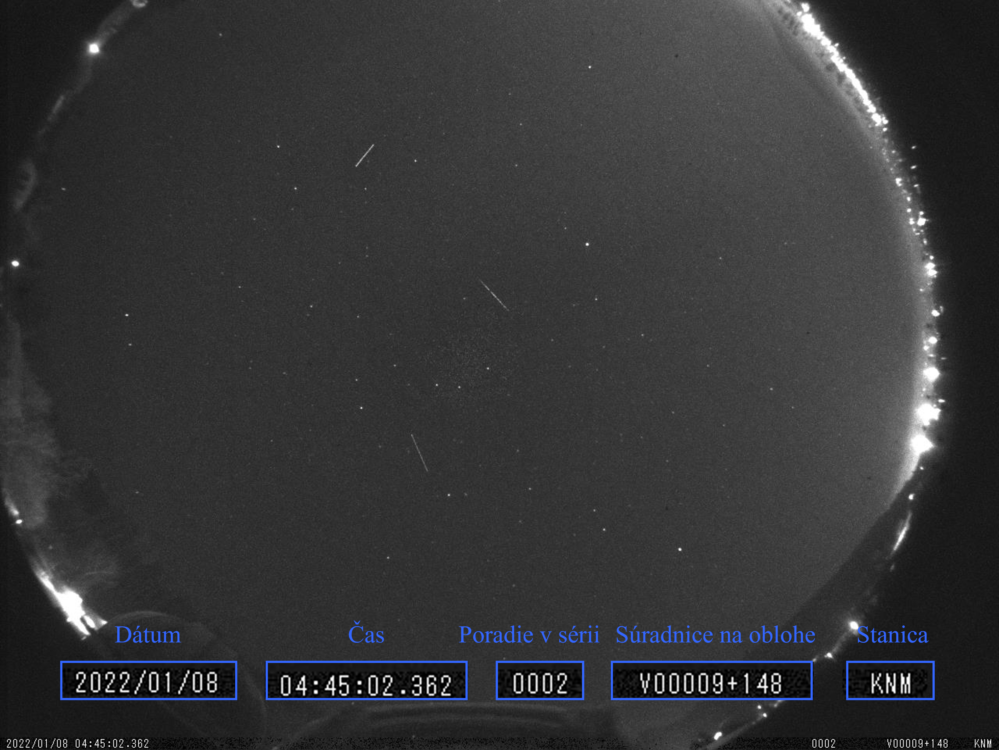
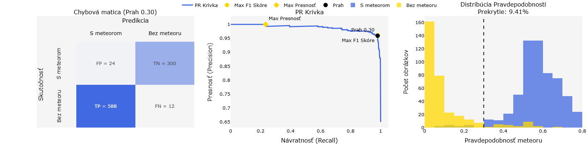

# Klasifikácia snímok s meteormi pomocou hlbokého učenia  

Tento repozitár obsahuje obrazové dáta, kód, trénované modely a ich vyhodnotenie vytvorené v rámci diplomovej práce, ktorej cieľom bolo natrénovať model na binárnu klasifikáciu snímok s meteormi zaznamenanými systémom **AMOS** (All-sky Meteor Orbit System), ktorý umožní automatizovať predspracovanie rozsiahlych dátových množín v produkčnom prostredí.


## ☄️ Dataset  
Dátovú množinu tvoria snímky získané zo šiestich slovenských AMOS staníc. Snímky sú vo formáte JPG, pričom každá snímka pokrýva 360-stupňové zorné pole monitorujúce nočnú oblohu. Súbor snímok pozostáva z obrazov s rozmermi 1280×960 a 1600×1200 pixelov. Farebná paleta snímok sa pohybuje v odtieňoch sivej.

Snímky sú rozdelené do kategórií na základe typu zachytávajúcich objektov. Pre účely diplomovej práce boli uvažované dve triedy:

- **Snímky s výskytom meteorov**

- **Snímky bez výskytu meteoru**



## 📁 Štruktúra adresárov:

Vo vetve `main` sa nachádzajú dva priečinky – `AMOS_data_povodne` s pôvodnými obrázkami a `project`, ktorý zastrešuje proces modelovania. Dáta sa rozdelili na množiny(`data_split_v2`), trénovali sa modely (`train`), ktoré sa uložili (`models`), vyhodnotili (`evaluation`), kombinovali za pomoci učenia súborom metód (`ensemble_learning`) a napokon bolo najlepšie riešenie nasadené (`deploy`).


```
main/
├── AMOS_data_povodne/       
└── project/                 
    ├── data_split_v2/       
    ├── deploy/              
    ├── ensemble_learning/   
    ├── evaluation/          
    ├── models/              
    └── train/               

```

## 🚀 Natrénované modely  
- Vlastná CNN architektúra (s SE blokmi)  
- EfficientNet-B4  
- ConvNeXt-Small  
- Swin Transformer 
- Data-efficient image Transformer (DeiT)  
- YOLOv11, YOLOv12 (modifikované na klasifikáciu)

Finálne riešenie využíva **vážený kombinovaný model** pozostávajúci z **ConvNeXt-Small** a **YOLOv11**.

## 📊 Vyhodnotenie  
- Presnosť, Návratnosť, F1 skóre, Presnosť klasifikácie  
- Kontingenčná tabuľka (confusion matrix)
- PR krivka
- Histogram distribúcií pravdepodobností  
- Vizualizácie pomocou **t-SNE** pre vektorové reprezentácie + zhlukovanie



## Poznámky  
- Modelovanie sa uskutočnilo školskom servri na GPU s 8 GB VRAM  
- Projekt je súčasťou diplomovej práce na **Katedre kybernetiky a umelej inteligencie Technickej univerzity v Košiciach**

---
